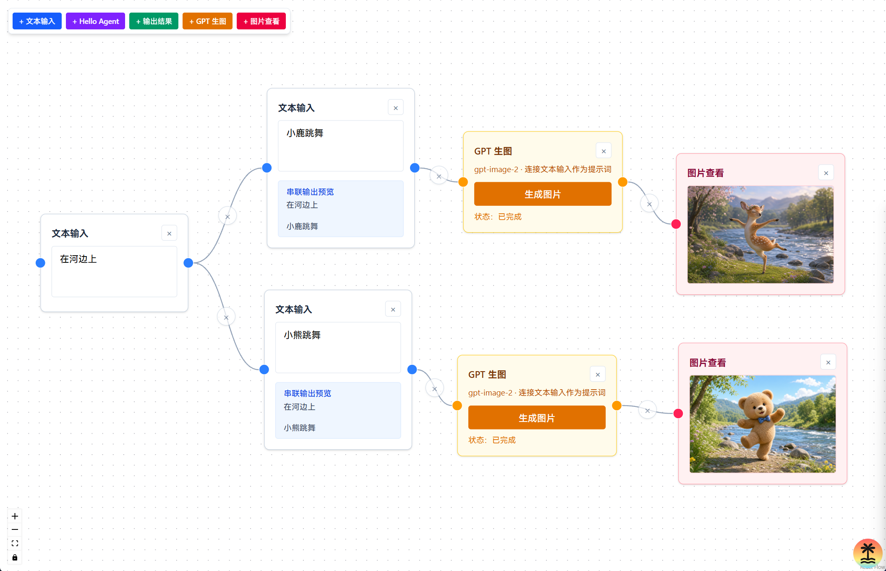

# MiniFlow

面向个人的可视化 Workflow 编辑器。通过拖拽节点、连线编排任务流，把文本输入、AI Agent、图片生成等能力组合成可复用的工作流。

> 项目定位：不只是 PPT 工具，而是逐步演进的个人自动化与工作流平台。



## 功能

- **可视化编排** — 基于 React Flow 的节点画布，支持拖拽、连线、复制粘贴
- **文本输入** — 作为工作流的数据入口
- **Hello Agent** — 调用 AI Agent 处理上游文本
- **GPT 生图** — 根据提示词生成图片
- **图片查看** — 展示并下载工作流中的图片结果
- **输出结果** — 汇聚并展示节点执行结果
- **用户认证** — 登录后使用，会话与数据隔离
- **本地持久化** — 流程结构保存至 localStorage，图片缓存至 IndexedDB

## 技术栈

- [TanStack Start](https://tanstack.com/start) + [TanStack Router](https://tanstack.com/router)
- [React Flow](https://reactflow.dev/) — 节点画布
- [Mastra](https://mastra.ai/) — AI Agent
- [Drizzle ORM](https://orm.drizzle.team/) + SQLite — 用户与会话
- [Valtio](https://valtio.dev/) — 流程状态管理
- [Tailwind CSS](https://tailwindcss.com/) — 样式

## 快速开始

### 环境要求

- [Bun](https://bun.sh/) >= 1.0

### 安装与运行

```bash
bun install
cp .env.example .env   # 填入 OPENAI_API_KEY 等配置
bun run db:seed <用户名> <密码>   # 创建首个登录用户
bun run dev
```

访问 http://localhost:3000

### 环境变量

| 变量 | 说明 |
|------|------|
| `OPENAI_API_KEY` | OpenAI 兼容 API 密钥 |
| `OPENAI_BASE_URL` | API 地址，默认 `https://api.openai.com/v1` |
| `DATABASE_PATH` | SQLite 数据库路径，默认 `./data/miniflow.db` |

### 其他命令

```bash
bun run build      # 生产构建
bun run preview    # 预览构建结果
bun test           # 运行测试
```

## 项目结构

```
src/
├── components/flow/   # 画布、节点、连线
├── components/auth/   # 登录与用户栏
├── mastra/            # AI Agent 与图片生成
├── server/            # 认证服务端逻辑
├── stores/            # 流程与图片状态
└── db/                # 数据库 schema
```

## License

MIT
